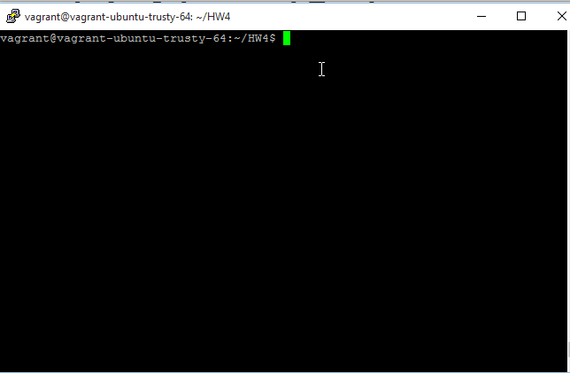
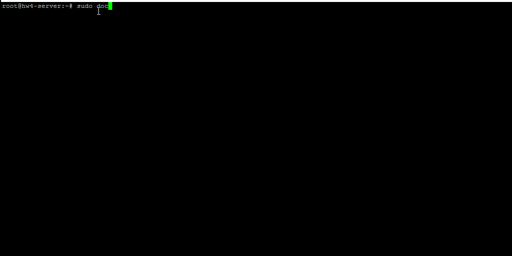
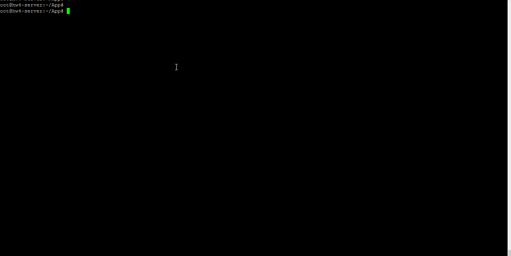

#Homework 4

##Goal 1
**_File IO_**

The docker build image file which exposes file over port 9001 is [container1](scripts/Dockerfile-container1) and the docker image which access the file from first container is [container2](scripts/Dockerfile-container2).

###Screencast

.

##Goal 2
**_Ambassador pattern_**

The server docker compose file is [docker-compose-server](scripts/docker-compose-server.yml) and client file is [docker-compose-client](scripts/docker-compose-client.yml)

###Screencast

.

##Goal 3
**_Docker Deploy_**

The commands in [post-receive](scripts/post-receive) pull from registery, stop existing app container and run new instance.

###Screencast

.